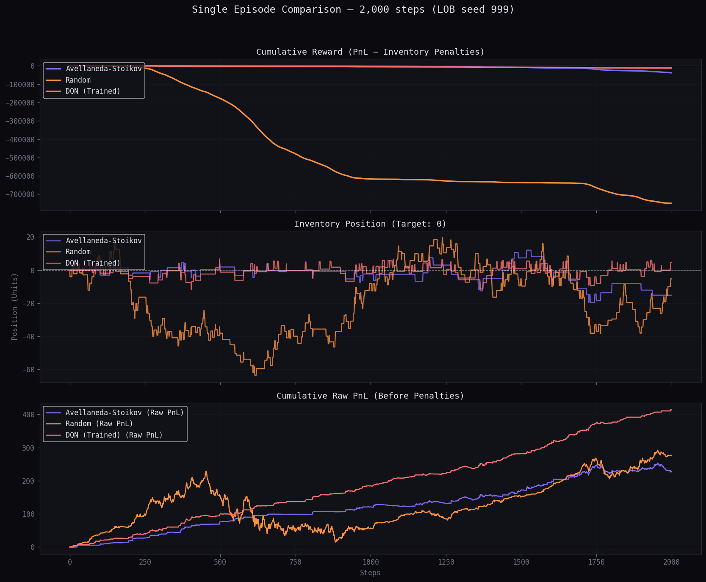
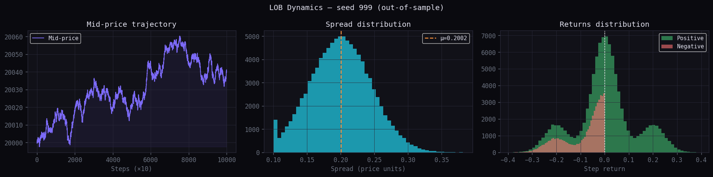

<div align="center">

# Deep Q-Learning for High-Frequency Market Making

**A Double DQN agent that learns to quote bid and ask prices on a synthetic Limit Order Book, benchmarked against the Avellaneda–Stoikov model and a random policy.**

*Antoine Mazet & Léo Pommier — Reinforcement Learning Project, April 2026*



</div>

---

## Overview

A market maker continuously quotes a bid and an ask price, earning the spread in exchange for providing liquidity. This activity carries two fundamental risks:

- **Inventory risk**: accumulating a directional position in an asset whose price moves against you.
- **Adverse selection**: being filled by better-informed traders who anticipate price movements.

This project trains a Double DQN agent to learn a quoting policy that balances spread capture and inventory control, and compares it to two baselines:

| Baseline | Role |
|---|---|
| **Avellaneda–Stoikov** | Closed-form, risk-averse analytical solution (primary benchmark) |
| **Random policy** | Uniformly random quotes (performance floor) |

## Key Results

Out-of-sample evaluation on a 2 000-step episode (seed 999):

| Strategy | Cum. Reward | Raw PnL | Penalty | Mean \|inv\| |
|---|---:|---:|---:|---:|
| **DQN (trained)** | **−11 484.8** | **+414.0** | 11 898.8 | **2.5** |
| Avellaneda–Stoikov | −37 975.8 | +228.0 | 38 203.9 | 4.2 |
| Random | −749 864.0 | +276.0 | 750 140.0 | 21.6 |

*Cumulative reward = Raw PnL − inventory penalty.*

- **Higher gross profit**: the DQN reaches a raw PnL above 400, versus around 230 for Avellaneda–Stoikov.
- **Tighter inventory control**: the agent keeps its position in a narrow corridor around zero and unwinds positions almost immediately.
- **Best risk-adjusted performance**: the DQN accumulates roughly 3x fewer inventory penalties than Avellaneda–Stoikov and 65x fewer than the random policy.

## Project Structure

```
.
├── env/
│   ├── data_lob.py      # Stochastic Limit Order Book simulator
│   └── MM_env.py        # Gymnasium-compatible trading environment
├── dqn_agent.py         # DQN: network, replay buffer, exploration
├── train_dqn.py         # Training loop
├── eval.py              # Unified evaluation framework
└── docs/                # Figures and report
```

## Usage

Train the agent:

```bash
python train_dqn.py
```

Evaluate the DQN against the baselines on the out-of-sample order book:

```bash
python eval.py
```

## Methodology

### 1. Synthetic Limit Order Book

The simulator combines six stochastic mechanisms to produce realistic market microstructure:

| Component | Model |
|---|---|
| Spread | Ornstein–Uhlenbeck mean reversion: $s_t = s_{t-1} + \kappa(\bar{s} - s_{t-1}) + \sigma_s \varepsilon_t$ |
| Mid-price | Random walk with order-book imbalance: $m_t = m_{t-1} + \sigma_m \eta_t + k_{imb} \frac{q^b_t - q^a_t}{q^b_t + q^a_t}$ |
| Order flow | Poisson arrivals of limit orders, market orders and cancellations |
| Queue dynamics | $q_t = q_{t-1} + L_t - M_t - C_t$ |
| Intensities | State-dependent arrival rates (spread width, book depth) |
| Price formation | $\text{bid}_t = m_t - s_t/2$, $\text{ask}_t = m_t + s_t/2$ |

To avoid look-ahead bias, two independent datasets are generated: **seed 42** (100 000 steps) for training and **seed 999** (50 000 steps) for out-of-sample evaluation.

<div align="center">

</div>

### 2. MDP Formulation

- **State**: $s_t = (m_t, s_t, q^b_t, q^a_t, \text{inv}_t)$ — mid-price, spread, best-level queue sizes and current inventory.
- **Actions**: 25 discrete quoting offsets $(\delta^b, \delta^a)$ on a 5 × 5 grid, with $\text{bid}^{agent}_t = m_t - \delta^b$ and $\text{ask}^{agent}_t = m_t + \delta^a$.
- **Reward**: profit penalised for directional exposure:

$$r_t = \Delta \text{PnL}_t - \alpha |\text{inv}_t| - \beta \, \text{inv}_t^2$$

### 3. Double DQN Agent

A standard DQN uses the same network to select and evaluate the greedy action, which systematically overestimates Q-values. Double DQN decouples the two roles:

$$y_t = r_t + \gamma \, Q_{target}\left(s_{t+1}, \arg\max_a Q(s_{t+1}, a; \theta)\right)$$

The online network selects the action; the target network evaluates it.

Other components:

- **Experience replay** to break temporal correlations between transitions.
- **Exponentially decaying ε-greedy exploration**: $\varepsilon_t = \varepsilon_{min} + (\varepsilon_{max} - \varepsilon_{min}) e^{-t/\tau_\varepsilon}$
- **Huber loss** with gradient clipping.

### Hyperparameters

| Hyperparameter | Value |
|---|---|
| Hidden layers | [256, 256], ReLU |
| Replay buffer | 10 000 transitions |
| Batch size | 64 |
| Discount γ | 0.99 |
| Target update | Every 500 steps |
| ε max / min / τ | 1.0 / 0.01 / 1 000 |
| Optimiser / Loss | Adam / Huber |

## Future Work

- **Richer state representations**: deeper LOB snapshots, multi-level order-flow imbalance, short-horizon volatility estimates.
- **Continuous action spaces**: Soft Actor-Critic or TD3 for fine-grained quote placement.
- **Realistic execution**: queue priority, partial fills and latency.
- **Live deployment**: calibration of LOB parameters on real tick data, with a risk guardrail module overriding the policy when inventory or drawdown limits are breached.

## Report

The full project report is available in [`docs/Market_Making_RL-POMMIER_MAZET.pdf`](docs/Market_Making_RL-POMMIER_MAZET.pdf).

## Authors

- **Antoine Mazet**
- **Léo Pommier**
